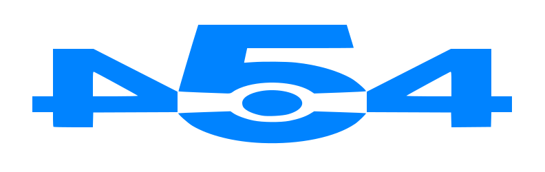
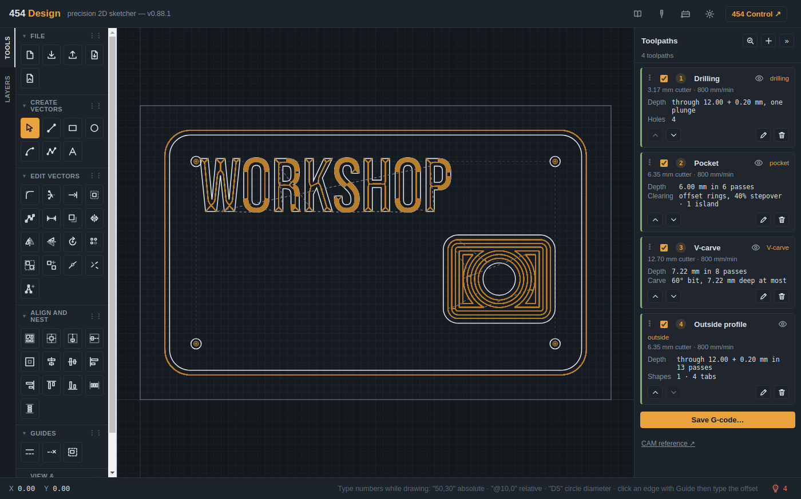
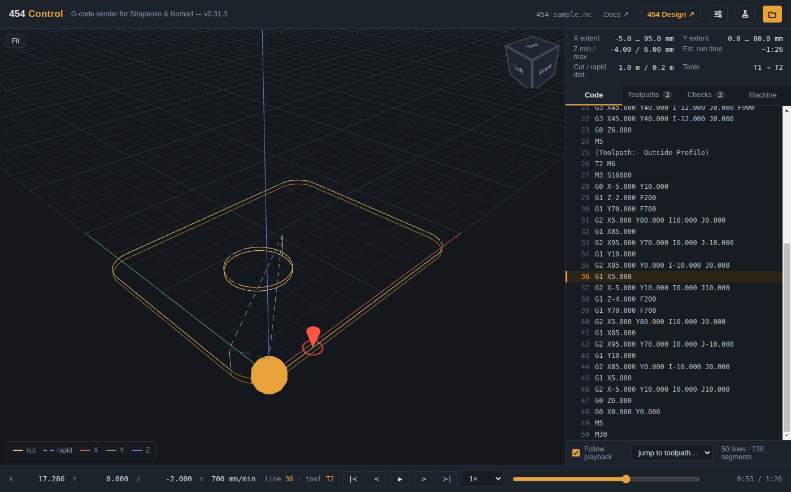

  

<h1 align="center">454 Workshop beta</h1>

  <b>Draw it, toolpath it, cut it.</b> 
  Free, open-source design, CAM and machine control for GRBL CNC routers like the Shapeoko and Nomad.

  <a href="https://454workshop.com"><b>454workshop.com</b></a>

  
  

<table>
  <tr>
    <td width="50%"></td>
    <td width="50%"></td>
  </tr>
  <tr>
    <td align="center"><b>454 Design</b>: a sign, from drawing to toolpaths</td>
    <td align="center"><b>454 Control</b>: checking a job before it's cut</td>
  </tr>
</table>

454 Workshop is two apps that work together:

- **454 Design** draws the parts: lines, arcs, shapes, text, traced images, layers and dimensions. It
  opens VCarve projects (with their toolpaths, even multi-sheet jobs) and DXF files, and exports DXF
  and SVG.
- **454 Control** runs the machine: it streams G-code to GRBL, and handles homing, zeroing, jogging,
  probing, the BitSetter and tool changes, following Carbide Motion's way of working step by step.

Both run in a web browser with nothing to install, and both come together in the **454 Workshop
desktop app** for Windows and Linux.

> **This is beta software.** The toolpaths in Design (CAM: profiles with tabs, pockets, drilling,
> chamfers, V-carving and inlays) are the newest part and still being tested. Check every job before
> cutting material: preview it in 454 Control, read its Checks tab, and run it in the air first. See
> the [CAM reference](https://454workshop.com/docs/cam-reference.html) for what to check.

## Why 454 Workshop?

- **Free and open source**, MIT licensed: use it, change it, share it.
- **Brings your VCarve work with you**: projects open with their drawings and toolpaths, and your
  VCarve tool library comes across with its feeds and speeds.
- **Works the way Carbide Motion does**, so the steps at the machine are the ones you already know;
  where 454 differs, the docs say so.
- **Machine behaviour is tested, not assumed**: spin-up waits, lifts before the spindle stops, tool
  changes and the end of every job are checked automatically on every change, by running real jobs
  through a simulated controller.
- **Works offline**: the desktop app needs no internet connection in the shop.

## Use it

- **In your browser:** open [454 Design](https://454workshop.com/design/) or
  [454 Control](https://454workshop.com/control/) at [454workshop.com](https://454workshop.com). Chrome or Edge is
  needed to connect to the machine (they support Web Serial).
- **Desktop app (in testing):** download 454 Workshop from the
  [Releases page](https://github.com/ctredway/454-workshop/releases). It works offline, keeps
  the machine connection in its own process, and opens Design and Control in their own windows.
- **[The documentation](https://454workshop.com/docs/)** covers getting started with each app and how 454
  differs from Carbide Motion.

## Safety

A CNC machine can hurt you and damage itself. 454 Workshop is provided as is, without warranty. Check
every job before you cut it: run it in the air first, keep a hand near the stop, and wear eye and ear
protection.

## Why 454?

454 is a nod to my dad. He was a huge Chevy guy, and when I was five he bought a 1967 Corvette with a
454 big block in it. He's the one who taught me how to build things, so I named my making after his
love for Chevy big blocks.

## Contributing and support

Bug reports and ideas are welcome as issues. If 454 Workshop is useful to you, the Sponsor button on
this page helps keep it going.

## Privacy

454 Workshop has no accounts, no telemetry and no analytics. Your drawings, tool library, settings and
G-code stay on your computer.

- **The desktop app** contacts one place by itself: GitHub, to see whether a newer version has been
  released (shortly after it starts, then every 6 hours while it's open). An update is downloaded only
  when you click to get it. Everything else the app needs is inside it, so it works with no internet
  connection.
- **Help → Report a problem…** opens a form on GitHub in your web browser, with the app's version and
  your Windows version filled in. Nothing is sent unless you submit the form.
- **The browser versions** at 454workshop.com are web pages: they're served by Cloudflare, and load
  fonts and a few open-source libraries from the public jsDelivr and cdnjs networks. As with any
  website, those services see your internet address. Your drawings and settings stay in your browser.

## Licence

MIT: free to use, change and share. All of 454 Workshop is free; there is no paid version. See `LICENSE`
and `LICENSING.md`.
